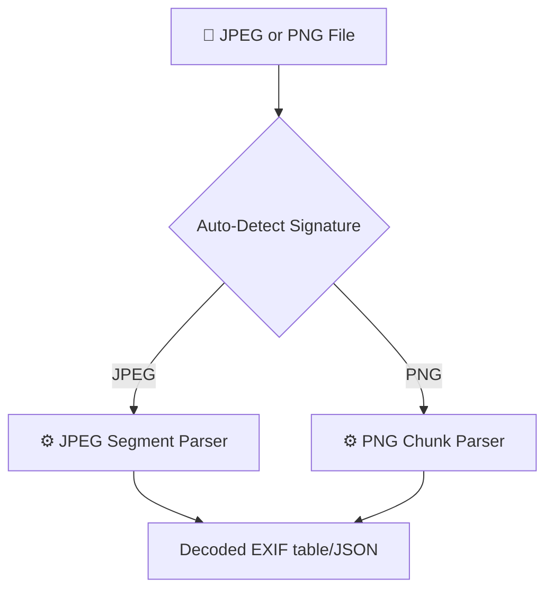

# 🖼️ `jpeg_meta_rs`

An enterprise-grade, high-performance Rust library and CLI tool designed to extract structural data, comments, text chunks, and EXIF parameters from JPEG and PNG files.



---

## 📖 Technical Documentation Map

We structure our manuals following the Separation of Concerns (SOC) and Single Source of Truth (SST) principles:

*   **🧬 [System Architecture & Design Manual](docs/ARCHITECTURE.md)**: Explains the internal crate module partitions, segment/chunk scanning flowcharts, and GPS DMS coordinate conversion logic.
*   **🛠️ [Command-Line Interface Reference](docs/CLI_REFERENCE.md)**: Syntax help, option parameters, and output presentation configurations.
*   **💻 [Developer & Contribution Guide](docs/DEVELOPER_GUIDE.md)**: Setup routines, testing frameworks (TDD), and parser customization guidelines.

---

## 🚀 Quick Start

### 1. Build and Compile
```bash
cargo build --release
```

### 2. Parse a JPEG file
```bash
./target/release/jpeg_meta_rs test_images/img6-gps.jpg
```

---

## 🔬 Test Suite (TDD)
Verify code soundness and format validators:
```bash
cargo test
```

---

## ⚖️ License
Distributed under the MIT License.
