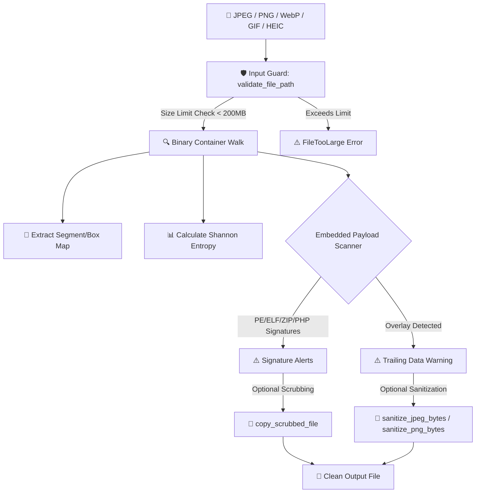

# 🖼️ `jpeg_meta_rs`

An enterprise-grade, zero-dependency, ultra-fast compiled systems language forensic engine and CLI suite designed to audit, scan, and sanitize binary image containers. It extracts structural segment/chunk layouts, parses EXIF/XMP metadata, calculates Shannon Entropy, detects hidden/embedded malicious payloads, and scrubs/sanitizes files.



---

## 🚀 Key Features

*   **⚡ Zero-Dependency Image Parsing**: Native structural scanners that sequentially parse segments, chunks, blocks, and boxes without loading pixel buffers into memory (microseconds runtime).
*   **📂 Multi-Format Support**: Comprehensive coverage for:
    *   **JPEG**: APP0-APP15, COM, DQT, DHT, SOF0/SOF2, SOS, and EXIF/XMP.
    *   **PNG**: Full chunk walk (IHDR, PLTE, IDAT, IEND, tEXt, iTXt, pHYs, tIME, iCCP, eXIf, sBIT, bKGD, oFFs, sCAL).
    *   **WebP**: RIFF container parsing, Extended Headers (`VP8X`), and `EXIF`/`XMP` metadata.
    *   **GIF**: Logical Screen Descriptor, Comment Extensions (`0xFE`), and XMP Application Extensions (`0xFF`).
    *   **HEIC**: ISOBMFF Box parsing, Spatial Extents (`ispe`), and TIFF EXIF decoding.
*   **🔍 Forensic Signature Scanner**: Walk-scans files starting at the logical end-of-file (EOF) offset to flag overlays, trailing payloads, or embedded assets (e.g., hidden ZIP archives, PDF docs, ELF binaries, PHP shells, or scripting blocks).
*   **🛡️ Verification & Anti-False-Positive Filtering**: Performs structural validation checks (like traversing the DOS header to verify the PE offset) to eliminate false positives in compressed data streams.
*   **🧼 Advanced Sanitizers & Scrubbers**:
    *   **Scrubbing**: Slices away any appended overlay payload from the end of the file.
    *   **Sanitization (Deep Cleaning)**: Strips out comments and metadata fields (APP1-APP15 in JPEG; ancillary/private chunks in PNG) to neutralize web shell injection threats.
*   **📊 Shannon Entropy Calculation**: Computes data randomness ($0.0$ to $8.0$ bits/byte) to identify encrypted payloads or high-entropy steganography.
*   **💾 Collision Resolution**: Automatically handles platform-aware file copies (resolving default Pictures directory for Windows, Linux, and macOS) and dynamically appends `_copy_1`, `_copy_2`, etc. to prevent file overwrites.

---

## 📖 Crate Documentation Map

We structure our manuals following the Separation of Concerns (SOC) and Single Source of Truth (SST) principles:

*   **🧬 [System Architecture & Design Manual](docs/ARCHITECTURE.md)**: Details the internal crate modules, parsing algorithms, sanitization workflows, and geo-conversions.
*   **🛠️ [Command-Line Interface Reference](docs/CLI_REFERENCE.md)**: Command structures, arguments, formatting rules, and execution modes.
*   **💻 [Developer & Contribution Guide](docs/DEVELOPER_GUIDE.md)**: Build instructions, test harness specifications (TDD), and dev setup.
*   **📖 [End-User Operation Guide](docs/USER_GUIDE.md)**: Command parameters, real-world scenario outputs, and Shannon Entropy evaluation tables.

---

## 💻 CLI Usage & Output Layout

### 1. Compile & Build
```bash
./build.sh
```

### 2. Basic Image Properties & Structure Scan
Run the CLI on one of the sample images to view the segment map, metadata parameters, and embedded payload alerts:
```bash
././analyzer test_images/img6-gps.jpg
```

**Expected Console Layout:**
```text
File: test_images/img6-gps.jpg
Type: JPEG Image Container

📂 JPEG Segment Structure map:
┌───────────────┬─────────────┬─────────────────────────────────┬────────────────────────┐
│ Marker Offset ┆ Marker Byte ┆ Segment Name                    ┆ Segment Length (Bytes) │
╞═══════════════╪═════════════╪═════════════════════════════════╪════════════════════════╡
│ 0x00000002    ┆ 0xFFE1      ┆ APP1 (EXIF/XMP)                 ┆ 10670                  │
├╌╌╌╌╌╌╌╌╌╌╌╌╌╌╌┼╌╌╌╌╌╌╌╌╌╌╌╌╌┼╌╌╌╌╌╌╌╌╌╌╌╌╌╌╌╌╌╌╌╌╌╌╌╌╌╌╌╌╌╌╌╌╌┼╌╌╌╌╌╌╌╌╌╌╌╌╌╌╌╌╌╌╌╌╌╌╌╌┤
│ 0x000029B0    ┆ 0xFFDB      ┆ DQT (Define Quantization Table) ┆ 199                    │
├╌╌╌╌╌╌╌╌╌╌╌╌╌╌╌┼╌╌╌╌╌╌╌╌╌╌╌╌╌┼╌╌╌╌╌╌╌╌╌╌╌╌╌╌╌╌╌╌╌╌╌╌╌╌╌╌╌╌╌╌╌╌╌┼╌╌╌╌╌╌╌╌╌╌╌╌╌╌╌╌╌╌╌╌╌╌╌╌┤
│ 0x00002A77    ┆ 0xFFC4      ┆ DHT (Define Huffman Table)      ┆ 420                    │
├╌╌╌╌╌╌╌╌╌╌╌╌╌╌╌┼╌╌╌╌╌╌╌╌╌╌╌╌╌┼╌╌╌╌╌╌╌╌╌╌╌╌╌╌╌╌╌╌╌╌╌╌╌╌╌╌╌╌╌╌╌╌╌┼╌╌╌╌╌╌╌╌╌╌╌╌╌╌╌╌╌╌╌╌╌╌╌╌┤
│ 0x00002C1B    ┆ 0xFFC0      ┆ SOF0 (Baseline DCT)             ┆ 19                     │
├╌╌╌╌╌╌╌╌╌╌╌╌╌╌╌┼╌╌╌╌╌╌╌╌╌╌╌╌╌┼╌╌╌╌╌╌╌╌╌╌╌╌╌╌╌╌╌╌╌╌╌╌╌╌╌╌╌╌╌╌╌╌╌┼╌╌╌╌╌╌╌╌╌╌╌╌╌╌╌╌╌╌╌╌╌╌╌╌┤
│ 0x00002C2E    ┆ 0xFFE1      ┆ APP1 (EXIF/XMP)                 ┆ 4033                   │
├╌╌╌╌╌╌╌╌╌╌╌╌╌╌╌┼╌╌╌╌╌╌╌╌╌╌╌╌╌┼╌╌╌╌╌╌╌╌╌╌╌╌╌╌╌╌╌╌╌╌╌╌╌╌╌╌╌╌╌╌╌╌╌┼╌╌╌╌╌╌╌╌╌╌╌╌╌╌╌╌╌╌╌╌╌╌╌╌┤
│ 0x00003BEF    ┆ 0xFFDA      ┆ SOS (Start of Scan)             ┆ 2                      │
└───────────────┴─────────────┴─────────────────────────────────┴────────────────────────┘

ℹ️ Image properties:
┌─────────────────┬──────────────────┐
│ Property        ┆ Value            │
╞═════════════════╪══════════════════╡
│ Width           ┆ 640 px           │
├╌╌╌╌╌╌╌╌╌╌╌╌╌╌╌╌╌┼╌╌╌╌╌╌╌╌╌╌╌╌╌╌╌╌╌╌┤
│ Height          ┆ 480 px           │
├╌╌╌╌╌╌╌╌╌╌╌╌╌╌╌╌╌┼╌╌╌╌╌╌╌╌╌╌╌╌╌╌╌╌╌╌┤
│ Data Precision  ┆ 8 bits           │
├╌╌╌╌╌╌╌╌╌╌╌╌╌╌╌╌╌┼╌╌╌╌╌╌╌╌╌╌╌╌╌╌╌╌╌╌┤
│ Color Channels  ┆ RGB / YCbCr (3)  │
├╌╌╌╌╌╌╌╌╌╌╌╌╌╌╌╌╌┼╌╌╌╌╌╌╌╌╌╌╌╌╌╌╌╌╌╌┤
│ Shannon Entropy ┆ 7.9102 bits/byte │
└─────────────────┴──────────────────┘

📸 Decoded EXIF Metadata parameters:
┌──────────────────────┬─────────────────────────────────────────────────┐
│ EXIF Field           ┆ Value                                           │
╞══════════════════════╪═════════════════════════════════════════════════╡
│ Camera Make          ┆ NIKON                                           │
├╌╌╌╌╌╌╌╌╌╌╌╌╌╌╌╌╌╌╌╌╌╌┼╌╌╌╌╌╌╌╌╌╌╌╌╌╌╌╌╌╌╌╌╌╌╌╌╌╌╌╌╌╌╌╌╌╌╌╌╌╌╌╌╌╌╌╌╌╌╌╌╌┤
│ Camera Model         ┆ COOLPIX P6000                                   │
├╌╌╌╌╌╌╌╌╌╌╌╌╌╌╌╌╌╌╌╌╌╌┼╌╌╌╌╌╌╌╌╌╌╌╌╌╌╌╌╌╌╌╌╌╌╌╌╌╌╌╌╌╌╌╌╌╌╌╌╌╌╌╌╌╌╌╌╌╌╌╌╌┤
│ GPS Latitude         ┆ 43.467255                                       │
├╌╌╌╌╌╌╌╌╌╌╌╌╌╌╌╌╌╌╌╌╌╌┼╌╌╌╌╌╌╌╌╌╌╌╌╌╌╌╌╌╌╌╌╌╌╌╌╌╌╌╌╌╌╌╌╌╌╌╌╌╌╌╌╌╌╌╌╌╌╌╌╌┤
│ GPS Longitude        ┆ 11.879213                                       │
├╌╌╌╌╌╌╌╌╌╌╌╌╌╌╌╌╌╌╌╌╌╌┼╌╌╌╌╌╌╌╌╌╌╌╌╌╌╌╌╌╌╌╌╌╌╌╌╌╌╌╌╌╌╌╌╌╌╌╌╌╌╌╌╌╌╌╌╌╌╌╌╌┤
│ GPS Date Stamp       ┆ 2008:10:23                                      │
└──────────────────────┴─────────────────────────────────────────────────┘

⚠️ DETECTED EMBEDDED / HIDDEN PAYLOADS:
┌──────────┬─────────────────────┬────────────┬────────────────────┬─────────────────────────────────────────────────┐
│ Category ┆ Payload Name        ┆ Offset     ┆ Length             ┆ First Bytes Preview                             │
╞══════════╪═════════════════════╪════════════╪════════════════════╪═════════════════════════════════════════════════╡
│ Image    ┆ Embedded JPEG Image ┆ 0x000011D0 ┆ Unknown / Variable ┆ FF D8 FF DB 00 C5 00 09 06 07 08 07 06 09 08 07 │
└──────────┴─────────────────────┴────────────┴────────────────────┴─────────────────────────────────────────────────┘
```

### 3. Sanitizing (Deep Cleaning) an Image
To scrub all metadata, comments, and private color profile blocks from an image:
```bash
././analyzer test_images/img6-gps.jpg --sanitize clean_image.jpg
```
Output:
```text
Successfully sanitized 'test_images/img6-gps.jpg' and saved to 'clean_image.jpg'.
```

---

## 🧬 Cargo Workspace Architecture

`jpeg_meta_rs` is organized as a Cargo workspace partitioned to guarantee absolute separation of concerns (SOC):

```text
├── Cargo.toml                  # Workspace Manifest
├── docs/                       # Crate Documentation Manuals
│   ├── ARCHITECTURE.md
│   ├── CLI_REFERENCE.md
│   └── DEVELOPER_GUIDE.md
├── src/                        # Root Binary Crate (jpeg_meta_rs)
│   ├── main.rs                 # CLI Argument parser & print orchestrator
│   ├── lib.rs                  # Format library modules registry
│   ├── common.rs               # Metadata models & EXIF helpers
│   ├── jpeg.rs                 # JPEG format parser
│   ├── png.rs                  # PNG format parser
│   ├── webp.rs                 # WebP format parser
│   ├── gif.rs                  # GIF format parser
│   └── heic.rs                 # HEIC format parser
├── utils/                      # Sub-Crate (jpeg_meta_utils library)
│   ├── Cargo.toml
│   └── src/
│       ├── lib.rs
│       ├── copy.rs             # Platforms-aware picture copy and scrubbing
│       ├── crc.rs              # PNG CRC-32 validation
│       ├── embedded.rs         # Signature walk-scans & PE validation
│       ├── entropy.rs          # Shannon entropy calculator
│       ├── error.rs            # Custom ValidationError definitions
│       ├── file_type.rs        # Image magic signatures validation
│       ├── geo.rs              # DMS GPS converters
│       ├── path.rs             # OOM-guarded path validation
│       └── validation.rs       # Metadata filter validations
└── test_images/                # Sample test images
```

---

## 🔬 Test Suite (TDD)
We enforce a test-driven development flow. Run the full test matrix locally:
```bash
./test.sh --all
```
Verify that all 41 test vectors pass successfully:
```text
running 21 tests in root-crate ... ok
running 20 tests in sub-crate ... ok
test result: ok. 41 passed; 0 failed; finished in 0.01s
```

---

## ⚖️ License
Distributed under the MIT License.
