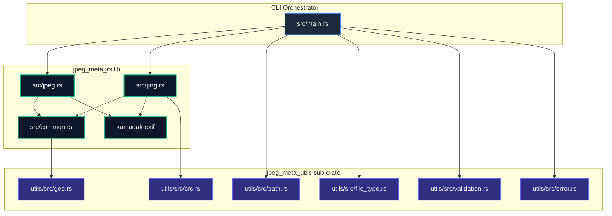
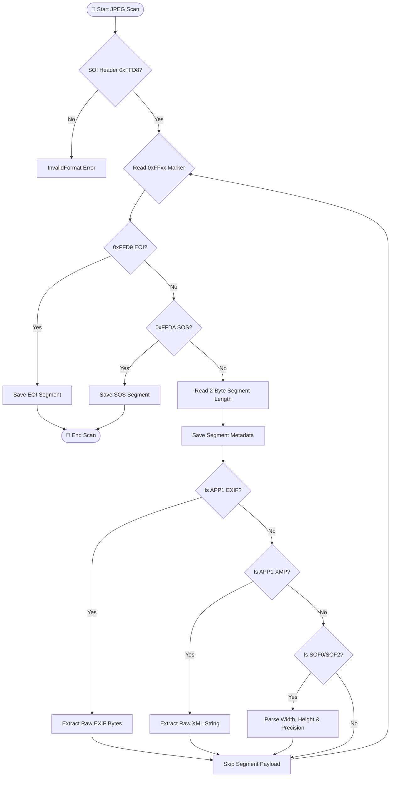
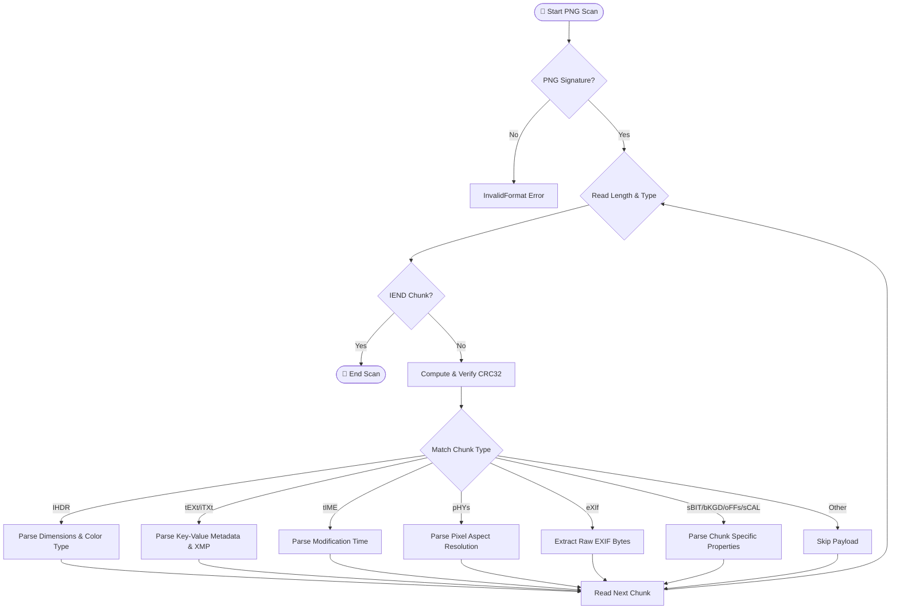

# 🧬 Crate Architecture & Design Manual

This document details the modular layout, parsing flowcharts, and technical data structures of `jpeg_meta_rs`.

---

## 🎨 1. Modular Core (Separation of Concerns & Workspaces)

The codebase is structured as a **Cargo Workspace** containing two distinct crates:
1.  `jpeg_meta_rs` (Root Crate): Contains the binary CLI application and library parsers for JPEG and PNG formats.
2.  `jpeg_meta_utils` (Sub-Crate): A dedicated library crate containing OJP validation engines, path/permission checkers, signature validation, custom errors, and math helpers.



---

## 🗺️ 2. Multi-File Dictionary Structures

When multiple files are analyzed, `main.rs` builds a `BTreeMap<String, FileAnalysis>` mapping file paths to their polymorphic metadata records:

```rust
#[derive(Serialize)]
#[serde(untagged)]
pub enum FileAnalysis {
    Jpeg(JpegInfo),
    Png(PngInfo),
}
```

This ensures that the final structured JSON output is returned as a single unified map, making it extremely easy to pipeline with downstream search utilities or databases.

---

## 📸 3. JPEG Segment Scanning Flow

The JPEG engine (`src/jpeg.rs`) parses the JPEG binary layout sequentially. It loops through segments using marker offsets:



---

## 🖼️ 4. PNG Chunk Scanning Flow

The PNG engine (`src/png.rs`) processes chunks according to the W3C PNG specification. Chunks consist of a 4-byte length, 4-byte ASCII type, payload, and a 4-byte CRC checksum:


