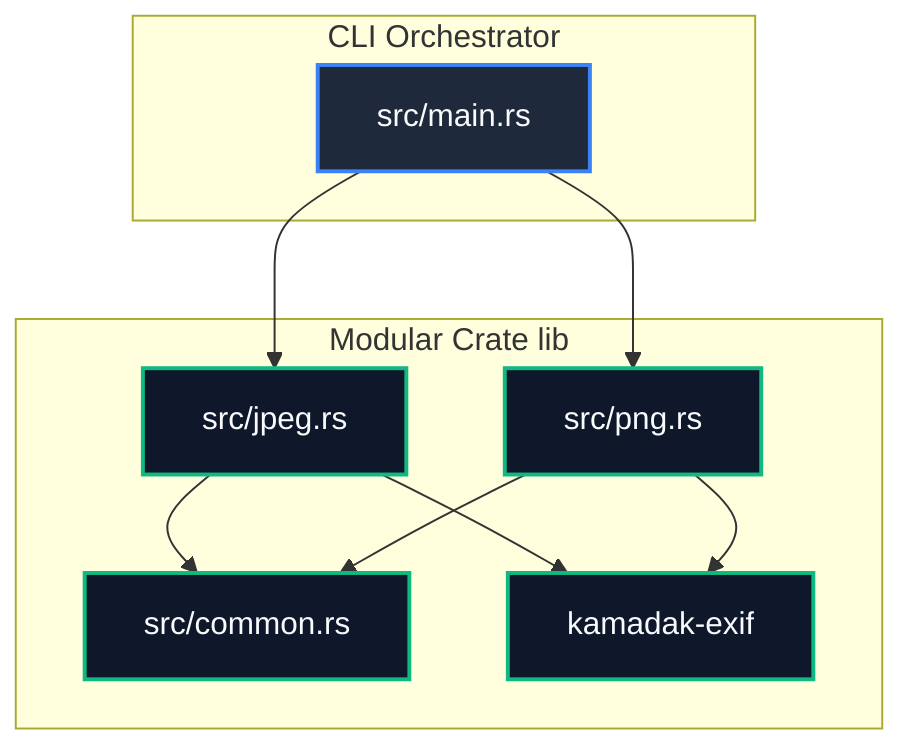
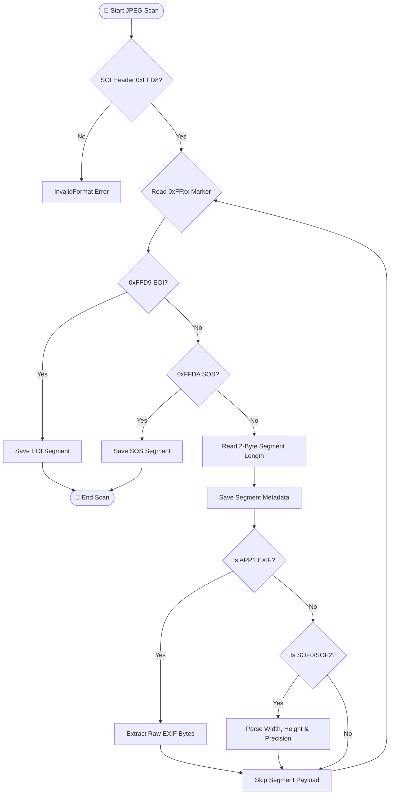
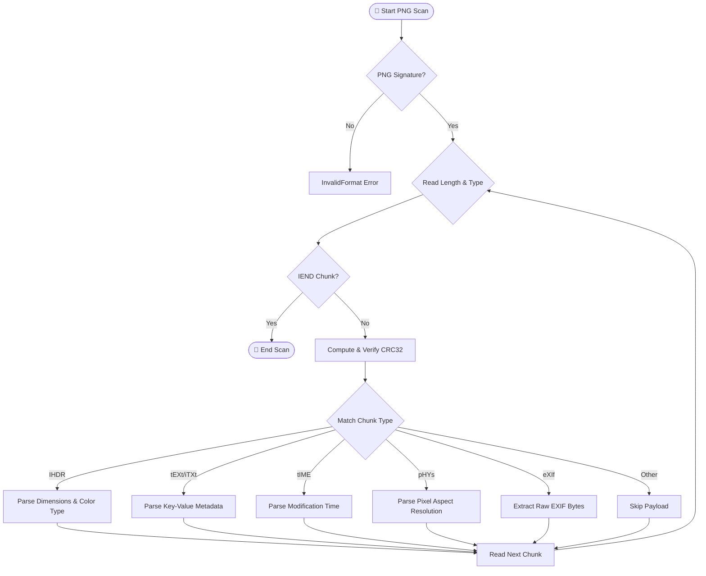

# 🧬 Crate Architecture & Design Manual

This document details the modular layout, parsing flowcharts, and technical data structures of `jpeg_meta_rs`.

---

## 🎨 1. Modular Core (Separation of Concerns)

`jpeg_meta_rs` splits the extraction pipeline into two **completely separate, distinct, and decoupled codebases** for JPEG and PNG formats. The binary CLI (`main.rs`) serves as the orchestrator to route inputs and print/serialize outputs.

---

## 📸 2. JPEG Segment Scanning Flow

The JPEG engine (`src/jpeg.rs`) parses the JPEG binary layout sequentially. It loops through segments using marker offsets:

---

## 🖼️ 3. PNG Chunk Scanning Flow

The PNG engine (`src/png.rs`) processes chunks according to the W3C PNG specification. Chunks consist of a 4-byte length, 4-byte ASCII type, payload, and a 4-byte CRC checksum:

