# 📖 `jpeg_meta_rs` User Guide

Welcome to the user guide for `jpeg_meta_rs`—an enterprise-grade binary forensics and sanitization tool for digital image containers. This document covers real-world usage instructions, parameter details, analysis layouts, and threat mitigation workflows.

---

## 📡 1. Global Syntax & Commands

All commands in the user manuals have been obfuscated to prevent search engines or bad actors from identifying the underlying technology stack. Execute the compiled binary `./analyzer` directly:

```bash
./analyzer [FLAGS] [OPTIONS] <FILES>...
```

### 📥 Core Option Matrix

| Parameter / Flag | Short | Description | Allowed Values |
|---|---|---|---|
| `--format` | `-f` | Formats output presentation. | `table` (Default), `json` |
| `--file-type` | `-t` | Forces parsing the file as a specific format. | `auto` (Default), `jpeg`, `png`, `webp`, `gif`, `heic` |
| `--filter-keys` | `-k` | Limits metadata rendering to matching keys. | Comma-separated list (e.g., `gps,make,model`) |
| `--exclude-structure`| N/A | Excludes the structural chunk/segment mapping table. | N/A |
| `--exclude-properties`| N/A | Excludes basic width/height/color properties. | N/A |
| `--exclude-exif` | N/A | Excludes decoded EXIF metadata table. | N/A |
| `--exclude-xmp` | N/A | Excludes raw XMP XML blocks. | N/A |
| `--exclude-text` | N/A | Excludes PNG text metadata (PNG only). | N/A |
| `--exclude-embedded` | N/A | Excludes forensic payload signature scans. | N/A |
| `--raw-sizes` | N/A | Displays file and segment sizes in raw bytes instead of human-readable formats. | N/A |
| `--sanitize` | N/A | Strips all comments, EXIF, and private blocks. | Path to output sanitized file |

---

## 🚀 2. Real-World Execution Scenarios

### A. General Inspection
To run a full forensic walk across one or more images:
```bash
./analyzer test_images/img6-gps.jpg
```

### B. Deep Sanitization (Stripping Metadata)
To create a clean copy of an image that has **zero** comments, EXIF fields, XMP data, or color profile blocks:
```bash
./analyzer test_images/img6-gps.jpg --sanitize sanitized_image.jpg
```
*Note: If `sanitized_image.jpg` already exists, the engine automatically resolves conflicts, writing to `sanitized_image_copy_1.jpg` instead of overwriting.*

### C. Filtering Specific Parameters
To view only camera details and GPS coordinates while scaling back structural layouts:
```bash
./analyzer --exclude-structure --filter-keys make,model,gps test_images/img6-gps.jpg
```

### D. JSON Data Pipeline
Export findings to a JSON file for database integration or automated log parsers:
```bash
./analyzer --format json test_images/img6-gps.jpg > output.json
```

### E. Disable Human-Readable Sizes (Raw Byte Mode)
To disable human-readable formatted sizes (e.g. `10.42 KB`, `199 B`) and print raw byte counts instead:
```bash
./analyzer --raw-sizes test_images/img6-gps.jpg
```

---

## 🔬 3. Expected Outcomes & Console Outputs

### Scenario I: Auditing JPEG Metadata (`img6-gps.jpg`)
Executing the analyzer on a JPEG containing GPS coordinates and embedded thumbnails prints a detailed segment layout, EXIF grid, and embedded alerts:

```text
File: test_images/img6-gps.jpg
Type: JPEG Image Container

📂 JPEG Segment Structure map:
┌───────────────┬─────────────┬─────────────────────────────────┬────────────────────────┐
│ Marker Offset ┆ Marker Byte ┆ Segment Name                    ┆ Segment Length (Bytes) │
╞═══════════════╪═════════════╪═════════════════════════════════╪════════════════════════╡
│ 0x00000002    ┆ 0xFFE1      ┆ APP1 (EXIF/XMP)                 ┆ 10670                  │
├╌╌╌╌╌╌╌╌╌╌╌╌╌╌╌┼╌╌╌╌╌╌╌╌╌╌╌╌╌┼╌╌╌╌╌╌╌╌╌╌╌╌╌╌╌╌╌╌╌╌╌╌╌╌╌╌╌╌╌╌╌╌╌┼╌╌╌╌╌╌╌╌╌╌╌╌╌╌╌╌╌╌╌╌╌╌╌╌┤
│ 0x000029B0    ┆ 0xFFDB      ┆ DQT (Define Quantization Table) ┆ 199                    │
├╌╌╌╌╌╌╌╌╌╌╌╌╌╌╌┼╌╌╌╌╌╌╌╌╌╌╌╌╌┼╌╌╌╌╌╌╌╌╌╌╌╌╌╌╌╌╌╌╌╌╌╌╌╌╌╌╌╌╌╌╌╌╌┼╌╌╌╌╌╌╌╌╌╌╌╌╌╌╌╌╌╌╌╌╌╌╌╌┤
│ 0x00002A77    ┆ 0xFFC4      ┆ DHT (Define Huffman Table)      ┆ 420                    │
└───────────────┴─────────────┴─────────────────────────────────┴────────────────────────┘

ℹ️ Image properties:
┌─────────────────┬──────────────────┐
│ Property        ┆ Value            │
╞═════════════════╪══════════════════╡
│ Width           ┆ 640 px           │
│ Height          ┆ 480 px           │
│ Shannon Entropy ┆ 7.9102 bits/byte │
└─────────────────┴──────────────────┘

📸 Decoded EXIF Metadata parameters:
┌──────────────────────┬─────────────────────────────────────────────────┐
│ EXIF Field           ┆ Value                                           │
╞══════════════════════╪═════════════════════════════════════════════════╡
│ Camera Make          ┆ NIKON                                           │
│ Camera Model         ┆ COOLPIX P6000                                   │
│ GPS Latitude         ┆ 43.467255 (43° 28' 2.118" N)                    │
│ GPS Longitude        ┆ 11.879213 (11° 52' 45.166" E)                   │
│ GPS Date Stamp       ┆ 2008:10:23                                      │
└──────────────────────┴─────────────────────────────────────────────────┘

⚠️ DETECTED EMBEDDED / HIDDEN PAYLOADS:
┌──────────┬─────────────────────┬────────────┬────────────────────┬─────────────────────────────────────────────────┐
│ Category ┆ Payload Name        ┆ Offset     ┆ Length             ┆ First Bytes Preview                             │
╞══════════╪═════════════════════╪════════════╪════════════════════╪═════════════════════════════════════════════════╡
│ Image    ┆ Embedded JPEG Image ┆ 0x000011D0 ┆ Unknown / Variable ┆ FF D8 FF DB 00 C5 00 09 06 07 08 07 06 09 08 07 │
└──────────┴─────────────────────┴────────────┴────────────────────┴─────────────────────────────────────────────────┘
```

---

### Scenario II: PNG Chunk Inspection (`flower.png`)
PNG files are structured as a series of distinct chunks. Running the tool output shows the offset mapping and validation of the CRC-32 checksums:

```text
File: test_images/flower.png
Type: Portable Network Graphics (PNG)

📂 PNG Chunk Structure map:
┌────────────┬────────────┬────────────────────────┬────────────┬────────────┐
│ Offset     ┆ Chunk Type ┆ Payload Length (Bytes) ┆ CRC Value  ┆ CRC Status │
╞════════════╪════════════╪════════════════════════╪════════════╪════════════╡
│ 0x00000008 ┆ IHDR       ┆ 13                     ┆ 0x63E069CB ┆ Valid      │
│ 0x00000021 ┆ sRGB       ┆ 1                      ┆ 0xAECE1CE9 ┆ Valid      │
│ 0x0000002E ┆ sBIT       ┆ 4                      ┆ 0x7C086488 ┆ Valid      │
│ 0x0000003E ┆ IDAT       ┆ 8192                   ┆ 0x61A320F2 ┆ Valid      │
│ 0x0000204A ┆ IDAT       ┆ 8192                   ┆ 0xEEACA1F1 ┆ Valid      │
│ 0x000E85AE ┆ IEND       ┆ 0                      ┆ 0xAE426082 ┆ Valid      │
└────────────┴────────────┴────────────────────────┴────────────┴────────────┘

ℹ️ Image properties:
┌─────────────────┬──────────────────┐
│ Property        ┆ Value            │
╞═════════════════╪══════════════════╡
│ Width           ┆ 1920 px          │
│ Height          ┆ 1080 px          │
│ Bit Depth       ┆ 8 bits/channel   │
│ Color Type      ┆ Truecolor RGB (2)│
│ Shannon Entropy ┆ 7.9543 bits/byte │
└─────────────────┴──────────────────┘
```

---

## 📊 4. Shannon Entropy Interpretation Guidelines

The Shannon Entropy value is an essential metrics index indicating the structural randomness of file segments. Because compressed image streams naturally have high entropy, you should interpret overall values using this baseline index:

```mermaid
gantt
    title Shannon Entropy (bits/byte) Threat Levels
    dateFormat  X
    axisFormat %s
    
    section Safe
    Sparse / Uncompressed Metadata (0.0 - 5.0) : active, 0, 5
    section Normal
    Standard Compressed Image Stream (5.0 - 7.5) : crit, 5, 7.5
    section Audit Required
    High Randomness / Crypt Payloads / Obfuscated Shells (7.5 - 8.0) : milestone, 7.5, 8.0
```



*   **0.0 to 5.0 (Low Entropy)**: Typical for uncompressed text blocks, comment headers, or padded data blocks. Indicates plain text or highly structured code.
*   **5.0 to 7.5 (Medium Entropy)**: Normal compression range. Safe level for standard image pixels.
*   **7.5 to 8.0 (High Entropy)**: Extreme randomness. This is normal for compressed pixel streams (`IDAT` or `SOS`), but if found in **appended segments** or **metadata containers**, it indicates the presence of encrypted payloads, zipped steganographic malware, or obfuscated binder executables.
